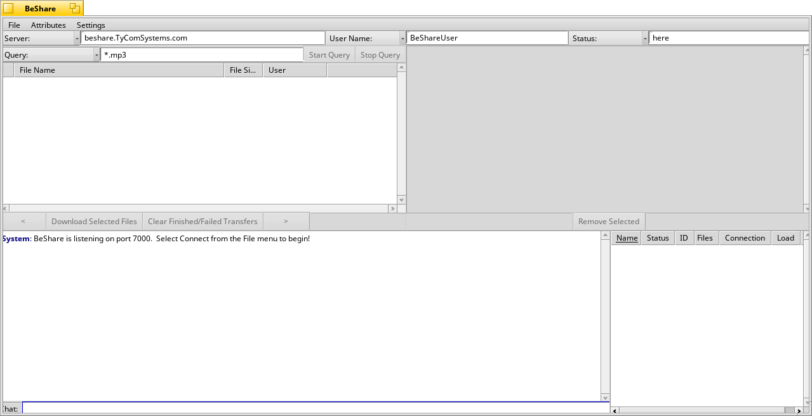

BeShare
===================

BeShare is a Haiku-native filesharing program. It operates similarly to
other such programs (Napster, Hotline, etc) but with a few advantages:

- BeShare allows you to upload or download any type of file, not just mp3.
- When browsing files, you can see their attributes (similar to Be's
Tracker view)
- Your query is always "live", so if new files that match your query become
available, you will see them added to the results list right away (you
won't have to click "refresh" or anything first)
- BeShare includes a rudimentary chat mechanism for you social types.
- BeShare supports any number of simultaneous uploads and downloads in
parallel, but will serialize simultaneous file requests to any given
host for efficiency.

NOTE:  If you are behind a firewall, make sure you have checked the
       "I'm Firewalled" menu item in the settings menu.  In this mode,
       other people who are not behind firewalls will be able to download
       from you, but other people who are also behind firewalls will
       not be able to see or download the files in your "shared" directory.
       
